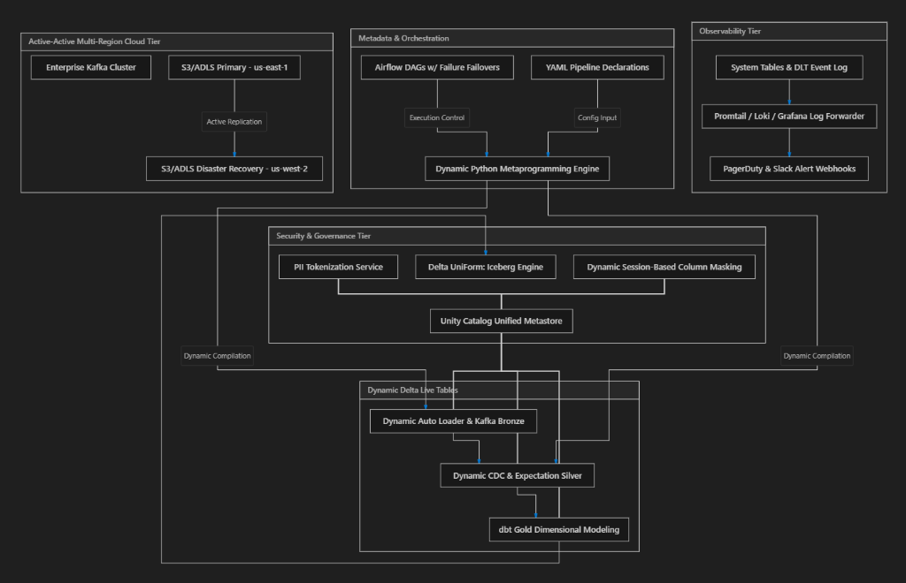

# Enterprise-Grade Metadata-Driven Lakehouse Platform on Databricks

[](https://github.com/PSURI1894/Lakehouse-on-Databricks-with-Unity-Catalog-and-Delta-Live-Tables/actions)
[](https://docs.databricks.com/release-notes/runtime/14.3lts.html)
[](https://delta.io/)
[](https://getdbt.com/)

This repository implements a production-grade, highly-governed, active-active multi-region **Lakehouse Platform** built on Databricks using a **Metadata-Driven ETL Architecture**.

---

## 1. System Architecture In-Depth

The platform processes real-time transaction events (from Apache Kafka) and batch file systems (from S3/ADLS landing zones), implementing a highly-governed Medallion pattern.



### Architectural Tier Breakdown:

1. **Active-Active Multi-Region Cloud Tier**:
   - Provisions primary cloud storage in US-East-1 (`S3/ADLS Primary`) and registers high-availability active replication to US-West-2 (`S3/ADLS Disaster Recovery`) to guarantee a 99.99% analytical uptime SLA.
   - Integrates real-time streams from an enterprise-grade `Apache Kafka` cluster alongside file-based landing zones.
2. **Metadata-Driven Control & Orchestration Plane**:
   - Replaces static, hardcoded pipelines with a centralized Python engine that parses declarative `YAML Pipeline Definitions` (`pipelines.yaml`) and compiles them dynamically at runtime into Spark executions.
   - Coordinated via `Apache Airflow DAGs` with built-in retry mechanisms, SLA sensors, and PagerDuty warning alerts.
3. **Dynamic Medallion Delta Live Tables (DLT)**:
   - **Bronze Layer**: Append-only ingestion utilizing **Auto Loader** for file events (`cloudFiles`), dynamically tracking schema evolution.
   - **Silver Layer**: Data cleansing, expectation boundaries (`WARN`, `DROP`, `FAIL`), and Change Data Capture (CDC) processing using DLT `APPLY CHANGES INTO` for SCD Type 1 & 2.
4. **Analytical Modeling Tier (dbt Core on Databricks SQL)**:
   - **Gold Layer**: Joins Silver tables to construct star-schema marts (`fct_orders`, `dim_customers`, `dim_products`). Runs on **Photon SQL Warehouses** with **Liquid Clustering** to optimize indexing on composite high-cardinality keys.
5. **Security, Governance & Interoperability**:
   - Governed under **Unity Catalog (UC)** with row-level filtering policies and session-based **Dynamic Column Masking** (hashing PII data like emails and phones based on role groups).
   - Generates Iceberg metadata metadata-synchronously via **Delta UniForm**, allowing external engines (Snowflake, Trino) to query physical tables directly without duplicating compute or storage.
6. **Observability & FinOps**:
   - Monitors operational events by parsing DLT pipeline event logs and system billing tables (`system.billing.usage`), exporting Loki/Promtail configurations to a centralized Grafana dashboard.

---

## 2. Directory Structure

```
.
├── .github/workflows/          # GitHub Actions multi-stage CI/CD validation
├── dabs/                       # Databricks Asset Bundles (DABs) environment compilation
├── notebooks/                  # Observability, optimization, and running notebooks
├── orchestration/              # Apache Airflow DAG scheduling blocks
├── src/
│   ├── dlt_engine/             # Dynamic DLT Compilation Engine
│   │   ├── metadata/           # YAML pipeline declaration manifests
│   │   ├── config_loader.py    # Pydantic schema validation models
│   │   └── pipeline_builder.py # Spark dynamic registration code
│   └── dbt_lakehouse/          # dbt modeling for Gold dimensional marts
│       ├── models/             # Star-schema models (fct_orders, dim_customers)
│       ├── dbt_project.yml     # dbt-databricks and UniForm configurations
│       └── profiles.yml        # dev/prod SQL Warehouse connections
├── tests/                      # Local unit testing with mocked Spark contexts
├── terraform/                  # Multi-region Infrastructure as Code (Terraform)
├── docs/                       # Architecture diagrams and system images
├── Makefile                    # Developer lifecycle commands
└── pyproject.toml              # Dependencies and formatting tool settings
```

---

## 3. Component Deep Dive

### A. Dynamic DLT Compilation Engine
Rather than creating separate boilerplate code for every table, the `DltPipelineCompiler` loops through configurations and registers decorators dynamically:
```python
# Programmatically compile Silver expectations from YAML rules
warn_rules = {k: v.expr for k, v in expectations.items() if v.action == "WARN"}
drop_rules = {k: v.expr for k, v in expectations.items() if v.action == "DROP"}
fail_rules = {k: v.expr for k, v in expectations.items() if v.action == "FAIL"}

def make_silver_stream():
    return dlt.read_stream(source_table)

decorated_func = make_silver_stream
if warn_rules:
    decorated_func = dlt.expect_all(warn_rules)(decorated_func)
if drop_rules:
    decorated_func = dlt.expect_all_or_drop(drop_rules)(decorated_func)
if fail_rules:
    decorated_func = dlt.expect_all_or_fail(fail_rules)(decorated_func)

globals()[table_name] = dlt.table(name=table_name)(decorated_func)
```

### B. Unity Catalog Role-Based Hashing Function
Configures custom hashing functions in `terraform/unity_catalog.tf` that hashes confidential PII values dynamically:
```sql
CREATE OR REPLACE FUNCTION mask_pii_email(email STRING)
RETURN SELECT CASE
  WHEN IS_MEMBER('payroll_admins') THEN email
  ELSE SHA2(CONCAT(email, 'ENTERPRISE_SECURE_SALT_128394'), 256)
END;
```

---

## 4. Developer Quickstart

### Prerequisites
* Python 3.10+
* Poetry / pipenv
* Databricks CLI 0.210+
* Terraform 1.5+

### Installation & Local Setup
1. Clone the repository and install developer dependencies:
   ```bash
   make install
   ```
2. Run code style check and linters:
   ```bash
   make lint
   ```
3. Run local unit tests (mocking Spark execution context):
   ```bash
   make test
   ```

### Deploying Databricks Asset Bundles (DABs)
To compile and deploy jobs and pipelines to the `development` workspace:
```bash
databricks bundle deploy --target development
```

---

## 5. Observability & FinOps Queries

Enterprise auditing queries are located in `notebooks/sys_observability.sql`. We track:
1. **DBU Spend Breakdown**: Analyzes compute resource charges over time.
2. **DLT Expectation Leakage**: Monitors the percentage of rows violating Silver expectations (e.g., invalid primary keys or missing values).
3. **Photon Cache Efficiency**: Tracks compilations and execution cache hit ratios.
